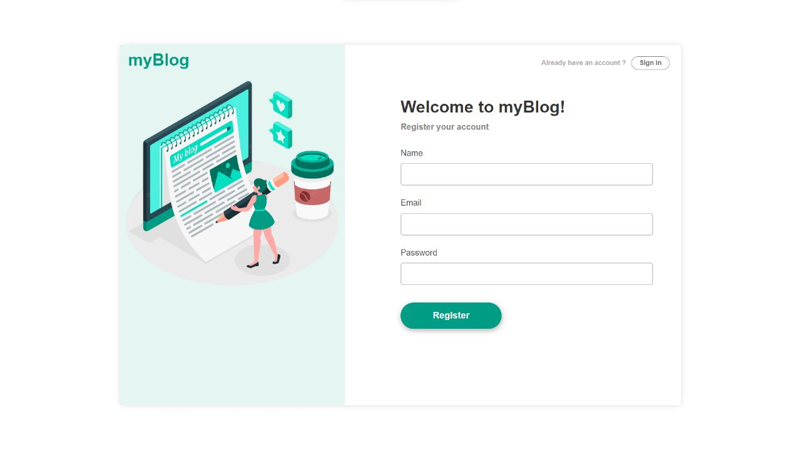
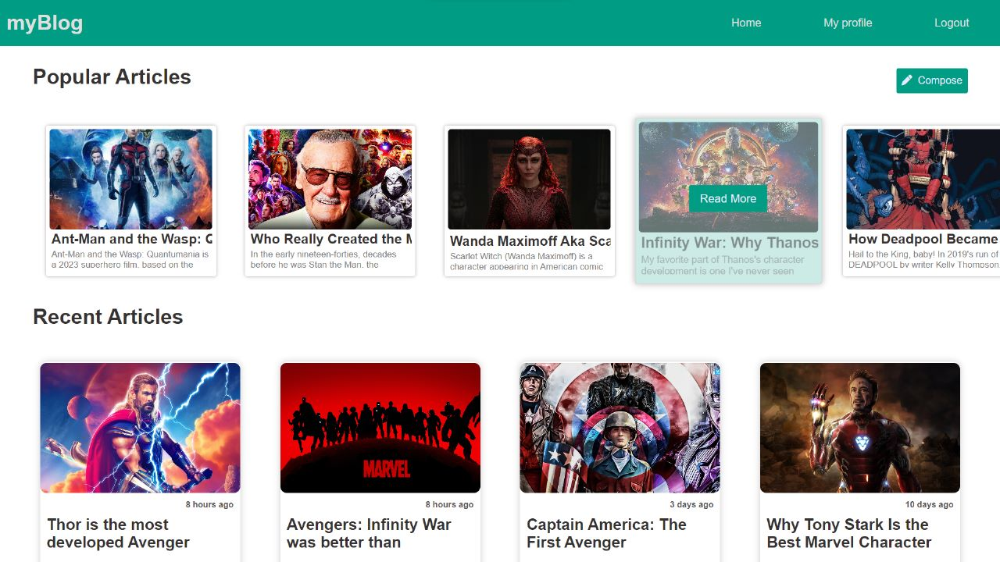
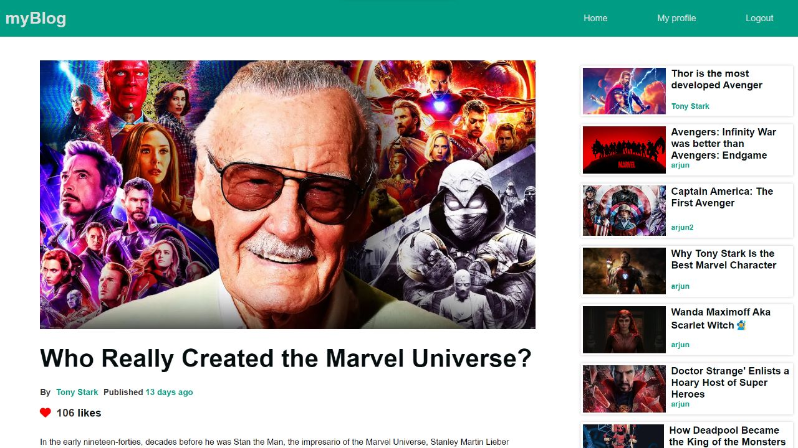

# Blogging Platform 📝

A simple blogging platform built using **HTML, CSS, and JavaScript** with MERN Technology for data persistence.  
Users can **sign up, log in, create posts, delete their posts, and add comments**.

## 🚀 Features
- User Authentication (Signup/Login/Logout)
- Create Blog Posts
- Delete Blog Posts (only by author)
- Comment Section
- Responsive Design (Mobile & Desktop)
- Data Persistence using LocalStorage


## 🛠️ How to Run
1. Clone the repo:
   ```bash
   git clone https://github.com/fahadmurad1/blogging-platform.git


## Installation

### Clone the Repository


### Install dependencies

npm install
```
### Start

node src/App.js

```sh
The Website will be available at http://localhost:3000
```
 **Screenshots**: 

<h3 align="center"> Login section</h3>

<h3 align="center"> Home Page</h3>

<h3 align="center"> Post View</h3>

<h3 align="center"> Profile Section</h3>

<h3 align="center"> Admin Dashboard </h3>

